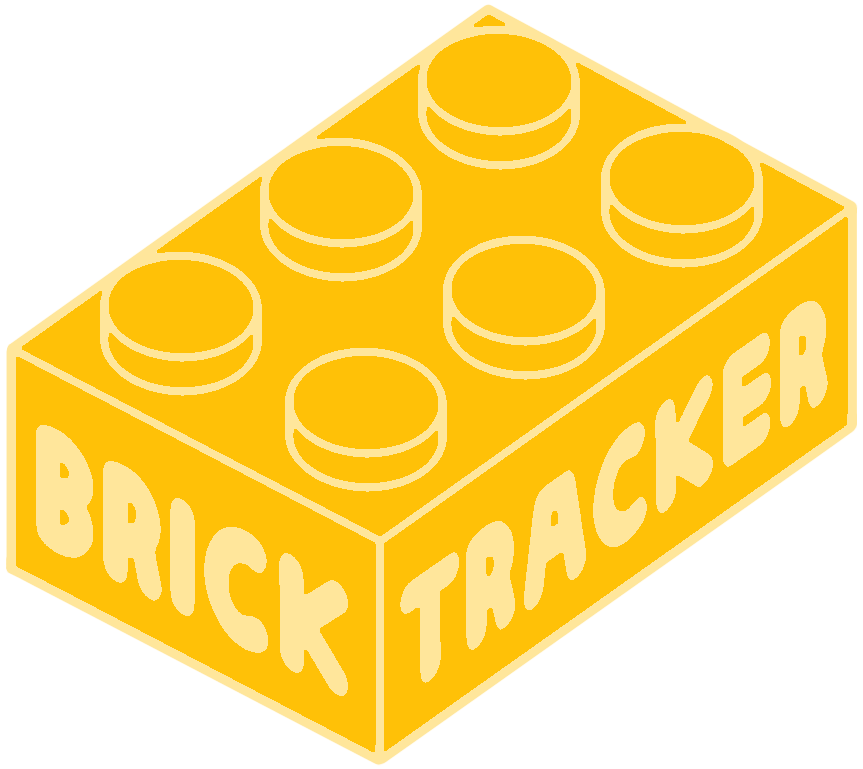

# BrickTracker

A web application for organizing and tracking LEGO sets, parts, and minifigures. Uses the Rebrickable API to fetch LEGO data and allows users to track missing pieces and collection status.

## Features

- Track multiple LEGO sets with their parts and minifigures
- Mark sets as checked/collected
- Mark minifigures as collected for a set
- Track missing pieces
- View parts inventory across sets
- View minifigures across sets
- Wishlist to keep track of what to buy

## Prefered setup: pre-build docker image

See [Quick Start](https://bricktracker.baerentsen.space/quick-start) to get up and running right away.

See [Walk Through](https://bricktracker.baerentsen.space/tutorial-first-steps) for a more detailed guide.

## Documentation

Most of the pages should be self explanatory to use.
However, you can find more specific documentation in the [documentation](https://bricktracker.baerentsen.space/whatis).

You can find screenshots of the application in the [overview](https://bricktracker.baerentsen.space/overview) documentation.
