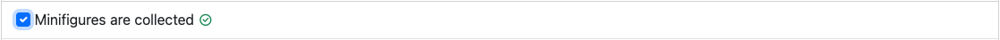
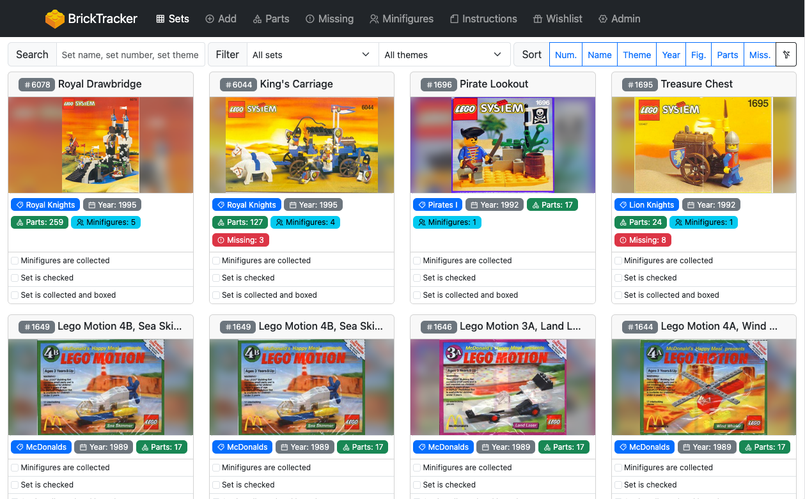
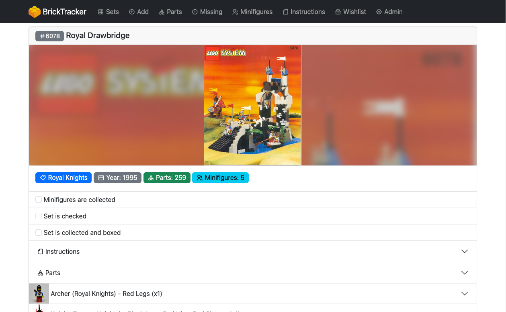
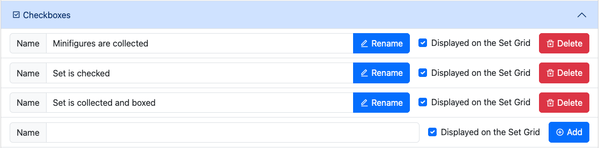
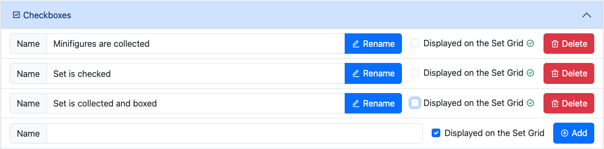
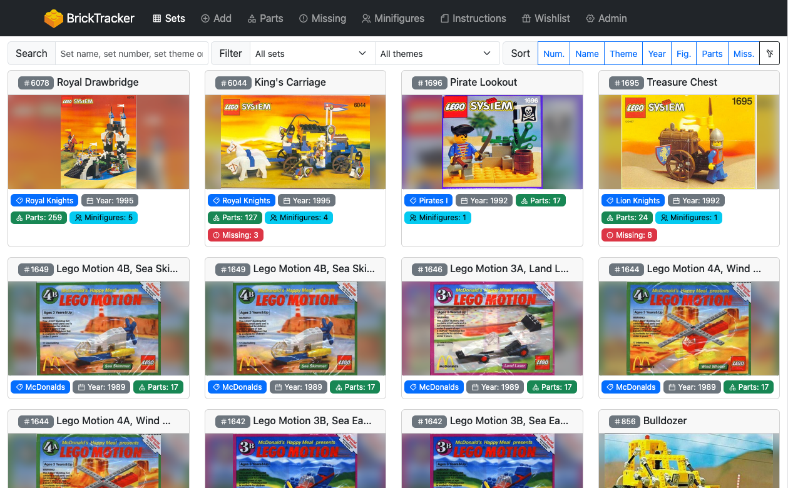
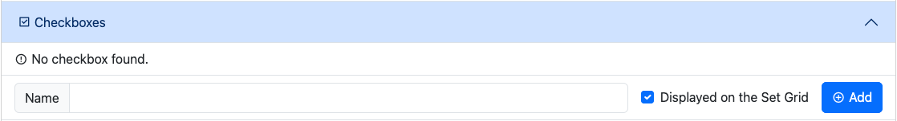

# Manage your set chechboxes

> **Note**
> The following page is based on version `1.1.0` of BrickTracker.

They are useful to store "yes/no" info about a set and quickly set it. Once clicked the change is immediatly stored in the database. A visual indicator tells you the change was succesful.

## Default checkboxes

The original version of BrickTracker defined the following checkboxes

- Minifigures are collected
- Set is checked
- Set is collected and boxed

## Visibility

The checkboxes are **never visible** on the front page. The display here tries to be as minimalistic as possible.

Prior to version `1.1.0`, the checkboxes were visible both on the Grid view (**Sets**) and the details of a set.

From version `1.1.0`, it is possible to decide if a checkbox is visible from the Grid or not. It will always be visible in a set details.

### Change the visibility of a checkbox

To change the visibility of a checkbox, head to the **Admin page** and open the **Checkboxes** section.

Simply click on the **Displayed on the Set Grid** checkbox to select whether it is displayed or not. The change is immediately saved to the database.

In this example, we have decided to have no checkbox visible on the Grid view.

## Management

Starting version `1.1.0`, you can manage the checkboxes for the **Checkboxes** section of the **Admin page**.

From there you can do the following:

- Add a new checkbox: use the last line of the list and press the **Add** button
- Rename an existing checkbox: use the **Name** field to change the name and press the **Rename** button
- Change the Grid display of an existing checkbox: tick or untick the **Displayed on the Set Grid** checkbox
- Delete an existing checkbox: use the **Delete** button and confirm on the following screen

It is possible to delete all the checkboxes, they are an optional component of a set.

